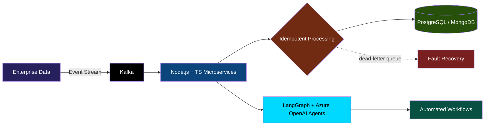

<div align="center">


<br/>

[](https://www.linkedin.com/in/manish-kumar-giri/)
[](mailto:manishgoswami495@gmail.com)
[](https://www.hackerrank.com/manishgoswami495)


</div>

<br/>

## 🎯 About Me

I've spent **5+ years making sure financial systems don't break when it matters most.**

I build **event-driven backend infrastructure** for enterprise-scale automation — systems where correctness isn't optional and performance directly affects business outcomes.

One of my contributions **improved processing performance by 40%** — that came from rethinking the architecture, not just optimizing code.

I now design backend systems for **AI-powered automation**, integrating **LLM-based agents** into production workflows to reduce manual, repetitive work.

<table>
<tr>
<td width="50%" valign="top">

**🏆 Recognition**
Top Performer — architecture contributions & measurable performance improvements

</td>
<td width="50%" valign="top">

**🎓 Research**
Published work on ML-based heart disease prediction — the starting point of my applied AI journey

</td>
</tr>
</table>

🟢 **Open to:** Senior Backend / Staff Engineer roles in `FinTech` · `Payments` · `AI-native Platforms` · `Enterprise Automation` · `Distributed Systems`

> If you're building something hard, let's talk.

---

## 🧭 Domain Breadth

I've shipped production systems across multiple industries — FinTech, gaming, blockchain, and enterprise workflow automation. Each domain taught me something different about what **"production-ready"** actually means.

<div align="center">

| 💰 FinTech | 🎮 Gaming | ⛓️ Blockchain | 🏢 Enterprise Automation |
|:---:|:---:|:---:|:---:|
| Financial automation & reconciliation at scale | Consumer product backends at scale | Hyperledger Fabric & Indy | Workflow & reconciliation systems |

</div>

---

## 🛠️ Core Stack

<div align="center">

**Backend & Event Streaming**
<br/>


**AI / LLM Orchestration**
<br/>


**Data & Storage**
<br/>


**Frontend**
<br/>


**Infra & DevOps**
<br/>


</div>

---

## 🏗️ How I Think About Systems


```mermaid
graph LR
    A[Enterprise Data] -->|Event Stream| B[Kafka]
    B --> C[Node.js + TS Microservices]
    C --> D{Idempotent Processing}
    D --> E[(PostgreSQL / MongoDB)]
    C --> F[LangGraph + Azure OpenAI Agents]
    F --> G[Automated Workflows]
    D -.dead-letter queue.-> H[Fault Recovery]

    style A fill:#26215C,color:#fff
    style B fill:#000,color:#fff
    style C fill:#0C447C,color:#fff
    style D fill:#712B13,color:#fff
    style E fill:#27500A,color:#fff
    style F fill:#00D9FF,color:#000
    style G fill:#085041,color:#fff
    style H fill:#791F1F,color:#fff
```

Correctness, fault tolerance, and zero data loss first — intelligence layered on top, not bolted underneath.

---

## 🚧 What I'm Building Now

- 🤖 Production **LLM agents** integrated into enterprise reconciliation/automation pipelines using **LangGraph**
- 🔗 Orchestration layers where AI agents operate inside strict, auditable, event-driven infrastructure — not standalone chatbots
- 📊 Applying the same rigor from distributed systems (idempotency, fault tolerance) to **agentic AI workflows**
- 🎓 Continuing applied AI/ML research, building on published work in ML-based heart disease prediction

---

## 📊 GitHub Analytics & Daily Activity

<div align="center">


<br/>


<br/>


</div>

### 🐍 Contribution Snake (daily commit graph, animated)

<div align="center">


</div>

> ⚙️ **One-time setup for the snake animation above** (this makes your daily commit streak visually undeniable):
> 1. Go to your profile repo → **Settings → Actions → General** → enable Actions
> 2. Add this file at `.github/workflows/snake.yml` in your `manish0502/manish0502` repo:
> ```yaml
> name: generate snake
> on:
>   schedule:
>     - cron: "0 */6 * * *"
>   workflow_dispatch: {}
>   push:
>     branches: [ main ]
> jobs:
>   generate:
>     runs-on: ubuntu-latest
>     steps:
>       - uses: Platane/snk@v3
>         with:
>           github_user_name: manish0502
>           outputs: dist/github-contribution-grid-snake-dark.svg
>       - uses: crazy-max/ghaction-github-pages@v4
>         with:
>           target_branch: output
>           build_dir: dist
>         env:
>           GITHUB_TOKEN: ${{ secrets.GITHUB_TOKEN }}
> ```
> 3. Commit it — the snake regenerates automatically every 6 hours from your real contribution graph.

<div align="center">

[](https://github.com/manish0502)

</div>

> 🔥 I commit daily — every graph above pulls live from GitHub and updates automatically.

---

## 🤝 Let's Talk

I'm open to **Senior Backend / Staff Engineer** roles at product companies working on hard problems in:

**FinTech · Payments · AI-native Platforms · Enterprise Automation · Distributed Systems**

<div align="center">

[](https://www.linkedin.com/in/manish-kumar-giri/)
[](mailto:manishgoswami495@gmail.com)
[](https://www.hackerrank.com/manishgoswami495)

</div>


</div>
