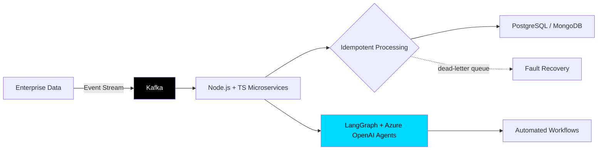

# 👋 Hi, I'm Manish Kumar Giri

### Senior Backend Engineer | Event-Driven Systems | Building AI-Native Automation

---

## 🎯 About Me

I've spent **5+ years making sure financial systems don't break when it matters most.**

I build **event-driven backend infrastructure** for enterprise-scale automation — systems where correctness isn't optional and performance directly affects business outcomes.

One of my contributions **improved processing performance by 40%** — that came from rethinking the architecture, not just optimizing code.

I now design backend systems for **AI-powered automation**, integrating **LLM-based agents** into production workflows to reduce manual, repetitive work.

🏆 Recognised as a **Top Performer** for architecture contributions and measurable performance improvements

🎓 Published research on **ML-based heart disease prediction** — where my interest in applied AI started

🟢 **Open to:** Senior Backend / Staff Engineer roles in FinTech · Payments · AI-native Platforms · Enterprise Automation · Distributed Systems

> If you're building something hard, let's talk.

---

## 🧭 Domain Breadth

I've shipped production systems across multiple industries — FinTech, gaming, blockchain, and enterprise workflow automation — and each one taught me something different about what **"production-ready"** actually means.

---

## 🛠️ Core Stack

### ⚙️ Backend & Event Streaming

### 🤖 AI / LLM Orchestration

### 🗄️ Data & Storage

### 🎨 Frontend (when the full stack needs it)

### ☁️ Infra & DevOps

---

## 🏗️ How I Think About Systems

```mermaid
graph LR
    A[Enterprise Data] -->|Event Stream| B[Kafka]
    B --> C[Node.js + TS Microservices]
    C --> D{Idempotent Processing}
    D --> E[PostgreSQL / MongoDB]
    C --> F[LangGraph + Azure OpenAI Agents]
    F --> G[Automated Workflows]
    D -.dead-letter queue.-> H[Fault Recovery]
    style F fill:#00D9FF,color:#000
    style B fill:#000,color:#fff
```

Correctness, fault tolerance, and zero data loss first — intelligence layered on top, not bolted underneath.

---

## 🚧 What I'm Building Now

- 🤖 Production **LLM agents** integrated into enterprise reconciliation/automation pipelines using **LangGraph**
- 🔗 Orchestration layers where AI agents operate inside strict, auditable, event-driven infrastructure — not standalone chatbots
- 📊 Applying the same rigor from distributed systems (idempotency, fault tolerance) to **agentic AI workflows**
- 🎓 Continuing applied AI/ML research, building on published work in ML-based heart disease prediction

---

## 📊 GitHub Analytics & Daily Activity

> 🔥 I commit daily — the streak stats and activity graph above update automatically and reflect real, ongoing work.

---

## 🤝 Let's Talk

I'm open to **Senior Backend / Staff Engineer** roles at product companies working on hard problems in:

**FinTech · Payments · AI-native Platforms · Enterprise Automation · Distributed Systems**

---

### 💫 "Clean code is not written by following a set of rules. Professionalism and craftsmanship come from values that drive disciplines." — Robert C. Martin

