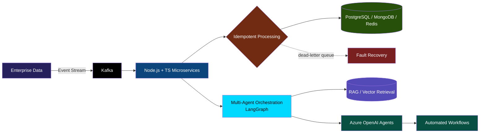

 

 

## 🎯 About Me

I've spent **5+ years writing production code** for systems that can't break when it matters most — full stack development, event-driven backend architecture, and system design at enterprise scale. Still hands-on and shipping code every day.

One of my contributions **improved processing performance by 40%** — that came from rethinking the architecture, not just optimizing code.

I now design **multi-agent AI systems** — RAG pipelines, agentic orchestration, LLM integration — building them with the same rigor I apply to distributed systems: fault tolerance, idempotency, and correctness first, intelligence layered on top.

💻 **Still hands-on daily** — writing production code, not just designing on paper. Architecture decisions are backed by code I ship myself.

<table>
<tr>
<td width="50%" valign="top">

**🏆 Recognition**
Top Performer — architecture contributions & measurable performance improvements

</td>
<td width="50%" valign="top">

**🎓 Research**
Published work on ML-based heart disease prediction — where my applied AI journey started

</td>
</tr>
</table>

🟢 **Open to:** Senior Backend / Staff Engineer roles in `FinTech` · `Payments` · `AI-native Platforms` · `Enterprise Automation` · `Distributed Systems`

> If you're building something hard, let's talk.

---

## 🧭 Domain Breadth

Production systems shipped across FinTech, gaming, blockchain, and enterprise workflow automation — each domain taught me something different about what **"production-ready"** actually means.

| 💰 FinTech | 🎮 Gaming | ⛓️ Blockchain | 🏢 Enterprise Automation |
|:---:|:---:|:---:|:---:|
| Financial automation & reconciliation at scale | Consumer product backends at scale | Hyperledger Fabric & Indy | Workflow & reconciliation systems |

---

## 🛠️ Skills

Not just calling LLM APIs — designing the orchestration layer around them: how agents plan, retrieve, reason, and hand off work reliably.

**🤖 Agentic AI & LLM Engineering**
 

  

| Area | What I work with |
|---|---|
| 🧠 **Agentic Orchestration** | Multi-agent architectures, agent handoff & routing, task decomposition, LangGraph state machines |
| 🔍 **RAG Systems** | Retrieval pipelines, vector search, chunking strategies, grounding LLM output in real data |
| 🛠️ **AI-Assisted Engineering** | Claude Code, Cursor — used for architecture, refactors, and system design, not just autocomplete |
| ✍️ **Prompt Engineering** | Structured prompting, tool-use design, context management for multi-step agent reliability |
| 🔗 **LLM Integration** | Azure OpenAI, LangChain, LangGraph — wired into existing event-driven backend systems |
| 🏗️ **System Design for AI** | Agent systems built with distributed-systems rigor — fault tolerance, observability, predictable failure modes |

 

**⚙️ Backend**
 

**🎨 Frontend**
 

**🗄️ Databases & Caching**
 

**☁️ Other — Infra, Cloud & DevOps**
 

**🔐 Security, Auth & Access Control**
 

---

## 🏗️ How I Think About Systems

```mermaid
graph LR
    A[Enterprise Data] -->|Event Stream| B[Kafka]
    B --> C[Node.js + TS Microservices]
    C --> D{Idempotent Processing}
    D --> E[(PostgreSQL / MongoDB / Redis)]
    C --> F[Multi-Agent Orchestration<br/>LangGraph]
    F --> R[(RAG / Vector Retrieval)]
    F --> H2[Azure OpenAI Agents]
    H2 --> G[Automated Workflows]
    D -.dead-letter queue.-> H[Fault Recovery]

    style A fill:#26215C,color:#fff
    style B fill:#000,color:#fff
    style C fill:#0C447C,color:#fff
    style D fill:#712B13,color:#fff
    style E fill:#27500A,color:#fff
    style F fill:#00D9FF,color:#000
    style R fill:#534AB7,color:#fff
    style H2 fill:#085041,color:#fff
    style G fill:#085041,color:#fff
    style H fill:#791F1F,color:#fff
```

Correctness, fault tolerance, and zero data loss first — intelligence layered on top, not bolted underneath.

---

## 📊 GitHub Analytics

 

 

> 🔥 I commit daily — every graph above pulls live from GitHub and updates automatically.

---

## 🤝 Let's Talk

Open to **Senior Backend / Staff Engineer** roles at product companies working on hard problems in:

**FinTech · Payments · AI-native Platforms · Enterprise Automation · Distributed Systems**

