```mermaid
mindmap
  root)💻 Manish's Expertise(
    🌐 Full Stack Development
      Frontend
        Angular
        TypeScript/JavaScript
        HTML/CSS/SASS
      Backend
        Node.js
        Express.js
        RESTful APIs
    🏗️ System Architecture
      Event-Driven Architecture
      Microservices
      System Design Patterns
      Scalable Solutions
    🧪 Quality Assurance
      Test Automation
        Cypress
        Jest
      Performance Testing
        K6
        Load Testing
      Quality Engineering
    🔗 Blockchain
      Smart Contracts
      DeFi Protocols
      Web3 Integration
      Zero Knowledge Proofs
    📊 Data Management
      MongoDB
      PostgreSQL
      Data Modeling
      Database Optimization
    ⚡ DevOps
      Docker
      CI/CD Pipelines
      Cloud Deployment
      Monitoring & Logging
```

#  Hi there, I'm Manish Kumar Giri

###  🚀 Passionate Full Stack Developer | System Architect | Blockchain Enthusiast

---

## &nbsp;***About Me***

 **Currently Working On:** Full Stack Development, System Design, Event-Driven Architecture, Test Automation with Cypress & Revolutionary Blockchain Projects

 **Currently Learning:** Generative AI & Advanced Machine Learning Techniques

 **Tech Writer:** Sharing insights on [LinkedIn](https://www.linkedin.com/pulse/deep-dive-zero-knowledge-proof-zk-snark-manish-kumar-giri-/) about cutting-edge technologies

 **Ask Me About:** Angular, Node.js, Express, MongoDB, PostgreSQL, Cypress Automation, Kafka, K6 Performance Testing & Blockchain Development

 **Reach Me:** [manishgoswami495@gmail.com](mailto:manishgoswami495@gmail.com)

 **Fun Fact:** I think I'm funny XD (and I probably am! 😄)

---

## <b> Tech Stack & Expertise</b>

###  Frontend Technologies

###  Backend Technologies

###  Databases & Storage

###  Testing & Quality Assurance

###  DevOps & Tools

###  Cloud & Deployment

###  Messaging & Communication

###  Development Tools

---

## <b> GitHub Analytics </b>

---

##  GitHub Trophies

---

## &nbsp;***Contribution Graph***

---

##  My Expertise Areas

---

##  Latest Blog Posts

- 🔗 [Deep Dive: Zero Knowledge Proof (ZK-SNARK)](https://www.linkedin.com/pulse/deep-dive-zero-knowledge-proof-zk-snark-manish-kumar-giri-/)
- 📈 Performance Testing Best Practices with K6
- 🔧 System Design Patterns for Scalable Applications
- 🌐 Building Event-Driven Architectures with Node.js and Kafka

---

##  Let's Connect

---

##  Current Focus

- 🤖 **Generative AI**: Exploring the cutting-edge of artificial intelligence
- 🔐 **Blockchain Innovation**: Building next-generation decentralized applications
- 🚀 **System Architecture**: Designing scalable, event-driven systems
- 🧪 **Test Automation**: Creating robust testing frameworks
- 📊 **Performance Engineering**: Optimizing application performance

---

###  🌟 "Code is like humor. When you have to explain it, it's bad." - Cory House

**Thanks for visiting my profile! Let's build something amazing together! 🚀**

