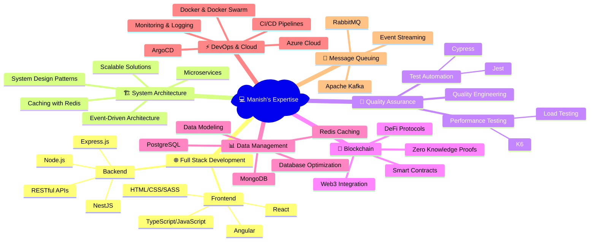

  
# 👋 Hi there, I'm Manish Kumar Giri

### 🚀 Passionate Full Stack Developer | System Architect | Blockchain Enthusiast | 5+ Years Experience

---

## 🎯 About Me

💼 **Experience:** 5+ years of professional software development excellence since August 2019

🔭 **Currently Working On:** Enterprise-grade Full Stack Applications, Scalable System Architecture, Event-Driven Microservices, Advanced Test Automation & Next-Gen Blockchain Solutions

🌱 **Currently Learning:** Generative AI, Advanced Machine Learning, Cloud-Native Architecture Patterns & Web3 Technologies

📝 **Tech Writer:** Sharing insights on [LinkedIn](https://www.linkedin.com/pulse/deep-dive-zero-knowledge-proof-zk-snark-manish-kumar-giri-/) about cutting-edge technologies and software engineering best practices

💬 **Ask Me About:** Angular, React, Node.js, NestJS, Express, MongoDB, PostgreSQL, Redis, Cypress Automation, Kafka, RabbitMQ, K6 Performance Testing, System Design & Blockchain Development

📫 **Reach Me:** [manishgoswami495@gmail.com](mailto:manishgoswami495@gmail.com)

⚡ **Fun Fact:** I believe great code should be as elegant as poetry - readable, efficient, and beautiful! 🎨

---

## 🛠️ Tech Stack & Expertise

### 🎨 Frontend Technologies

### ⚙️ Backend Technologies

### 🗄️ Databases & Storage

### 🧪 Testing & Quality Assurance

### 🔧 DevOps & Tools

### ☁️ Cloud & Deployment

### 🔗 Messaging & Communication

### 🛠️ Development Tools

---

## 📊 GitHub Analytics

  

  

---

## 🏆 GitHub Trophies

  

---

## 📈 Contribution Graph

  

---

## 🎯 My Expertise Areas

```mermaid
mindmap
  root)💻 Manish's Expertise(
    🌐 Full Stack Development
      Frontend
        React
        Angular
        TypeScript/JavaScript
        HTML/CSS/SASS
      Backend
        Node.js
        NestJS
        Express.js
        RESTful APIs
    🏗️ System Architecture
      Event-Driven Architecture
      Microservices
      System Design Patterns
      Scalable Solutions
      Caching with Redis
    🧪 Quality Assurance
      Test Automation
        Cypress
        Jest
      Performance Testing
        K6
        Load Testing
      Quality Engineering
    🔗 Blockchain
      Smart Contracts
      DeFi Protocols
      Web3 Integration
      Zero Knowledge Proofs
    📊 Data Management
      MongoDB
      PostgreSQL
      Redis Caching
      Data Modeling
      Database Optimization
    ⚡ DevOps & Cloud
      Docker & Docker Swarm
      ArgoCD
      Azure Cloud
      CI/CD Pipelines
      Monitoring & Logging
    📡 Message Queuing
      Apache Kafka
      RabbitMQ
      Event Streaming
```

---

## 📝 Latest Blog Posts & Articles

- 🔗 [Deep Dive: Zero Knowledge Proof (ZK-SNARK)](https://www.linkedin.com/pulse/deep-dive-zero-knowledge-proof-zk-snark-manish-kumar-giri-/)
- 🚀 Microservices Architecture Patterns with Node.js & NestJS
- 📈 Performance Testing Best Practices with K6
- 🔧 System Design Patterns for Scalable Applications
- 🌐 Building Event-Driven Architectures with Kafka & RabbitMQ
- ⚡ Redis Caching Strategies for High-Performance Applications
- 🧪 Advanced Test Automation with Cypress & Jest
- ☁️ Cloud-Native Development on Azure: Best Practices

---

## 🤝 Let's Connect

---

## 💡 Current Focus & Expertise

- 🤖 **Generative AI & ML**: Exploring cutting-edge artificial intelligence and machine learning applications
- 🔐 **Blockchain Innovation**: Building next-generation decentralized applications and smart contracts
- 🏗️ **System Architecture**: Designing scalable, event-driven microservices with Redis caching strategies
- 🧪 **Test Automation**: Creating comprehensive testing frameworks with Cypress, Jest, and K6
- 📊 **Performance Engineering**: Optimizing application performance and system scalability
- ☁️ **Cloud-Native Development**: Building resilient, scalable solutions on Azure with containerization
- 🔄 **DevOps Excellence**: Implementing CI/CD pipelines with Docker, ArgoCD, and GitOps practices

---

### 💫 "Clean code is not written by following a set of rules. You don't become a software craftsman by learning a list of heuristics. Professionalism and craftsmanship come from values that drive disciplines." - Robert C. Martin

**Let's collaborate and build something extraordinary together! 🚀**

